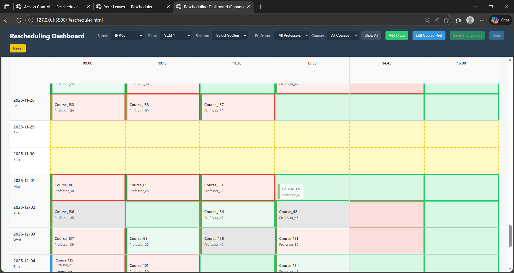
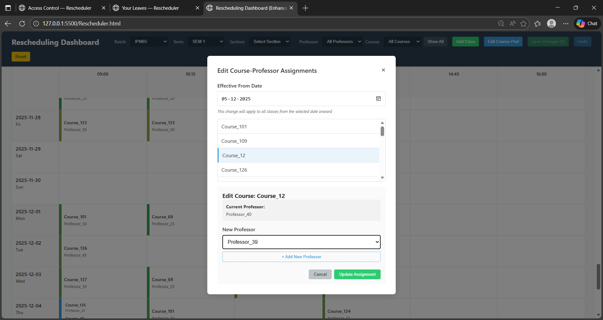
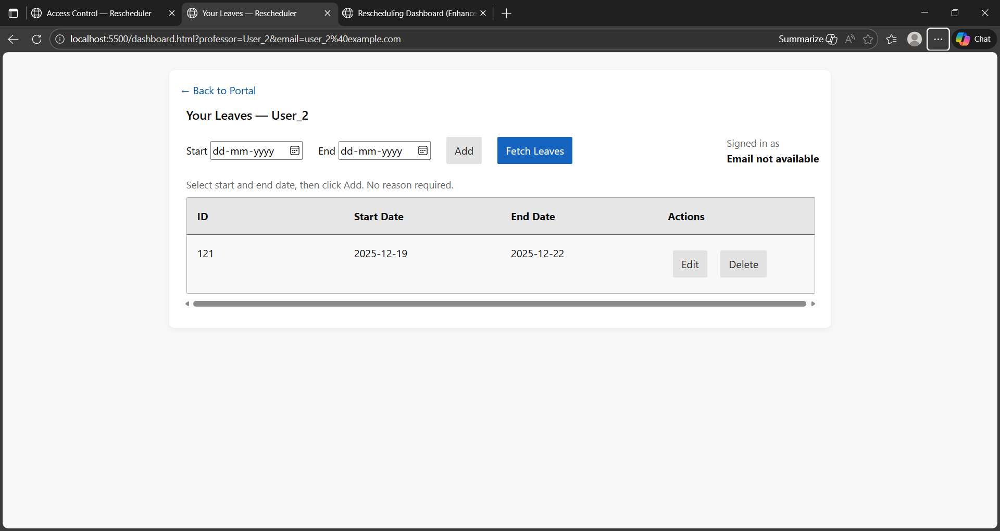
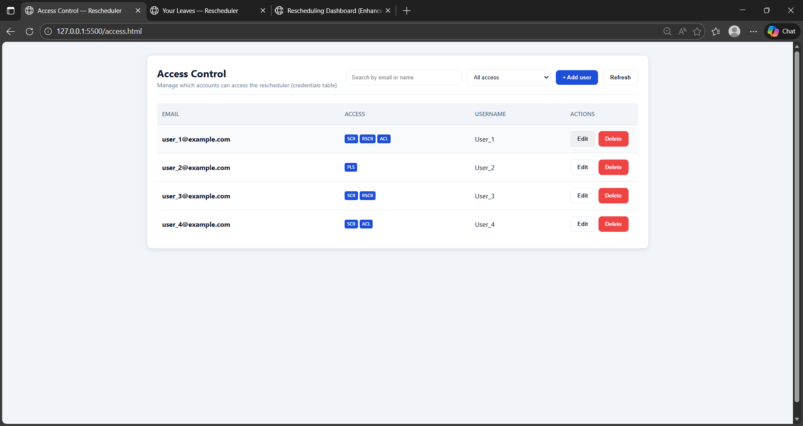
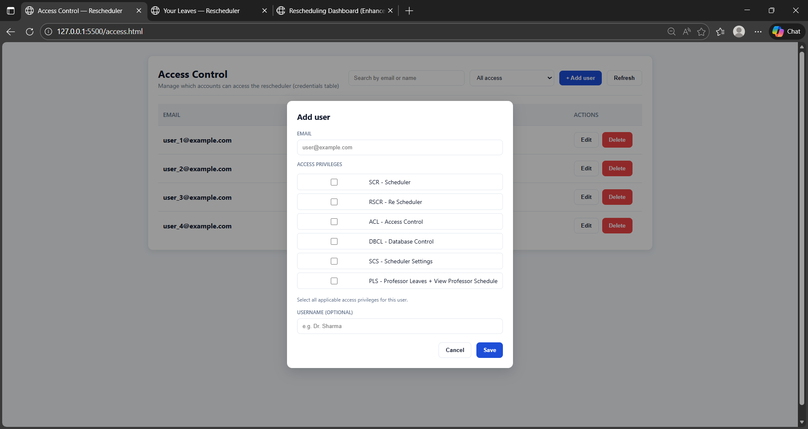

# 📅 Faculty Rescheduler & Leave Management System

<div align="center">
<p align="center">
  
</p>

### Intelligent Academic Scheduling Platform

A comprehensive scheduling platform developed for **IIM Bodh Gaya** to streamline faculty timetable management, leave handling, access control, and conflict-aware class rescheduling.

---


</div>

---

## Overview

Managing academic timetables becomes increasingly difficult when faculty members take leave or course assignments change. Manual rescheduling often results in conflicts, duplicated effort, and inconsistent schedules.

This project provides a centralized scheduling platform that enables administrators to manage timetables visually while allowing faculty members to manage their own leaves through a dedicated portal.

The system combines timetable visualization, drag-and-drop rescheduling, leave management, role-based access control, and course assignment administration into a single workflow.

---

# ✨ Core Features

## 📅 Intelligent Rescheduler

- Drag-and-drop class rescheduling
- Interactive timetable interface
- Conflict-aware scheduling
- Real-time validation
- Batch, term and section filters
- Professor filtering
- Course filtering
- Add new classes
- Undo and reset functionality


---

# 👨‍🏫 Course–Professor Assignment Management

Administrators can update course ownership without manually editing schedules.

Features include:

- Effective date support
- Course selection
- Professor reassignment
- Future schedule updates
- Automatic timetable synchronization



---

# 🗓 Professor Leave Portal

Faculty members have a dedicated portal to manage leave requests.

Capabilities include

- View existing leaves
- Add new leave periods
- Edit leave entries
- Delete leave records
- Leave history
- Professor-specific dashboard



---

# 🔐 Role-Based Access Control

Different users are granted access only to the modules they require.

Supported permissions include

- Scheduler
- Rescheduler
- Access Control
- Database Control
- Scheduler Settings
- Professor Leave Portal



---

# 👥 User Management

Administrators can create and manage user accounts with granular permission control.

Functions include

- Create users
- Assign permissions
- Edit access privileges
- Delete users
- Username management
- Permission filtering



---

# 🚀 Key Features

### Scheduler

- Drag-and-drop timetable editing
- Dynamic timetable rendering
- Conflict validation
- Add classes
- Undo changes
- Reset schedules
- Multi-filter support

### Leave Management

- Faculty leave portal
- CRUD operations
- Conflict-aware scheduling
- Professor-specific access

### Administration

- Role-based permissions
- User management
- Access control
- Course assignment management

---

# 🖥 Tech Stack

## Frontend

- HTML5
- CSS3
- Vanilla JavaScript (ES Modules)

## Backend

- Python
- FastAPI
- Uvicorn

## Database

- SQLite

---

# 🏗 System Architecture

```
Faculty
      │
      ▼
Leave Portal
      │
      ▼
FastAPI Backend
      │
      ├──────────────┐
      ▼              ▼
SQLite DB      Access Control
      │
      ▼
Rescheduler Engine
      │
      ▼
Interactive Timetable
```

---

# 📂 Project Structure

```text
Faculty-Rescheduler
│
├── src/
│   ├── api/
│   │   ├── main.py
│   │   ├── accesscontrolserver.py
│   │   ├── profleaveserver.py
│   │   └── reschedulerserver.py
│   │
│   ├── frontend/
│   │   ├── rescheduler.html
│   │   ├── access.html
│   │   ├── dashboard.html
│   │   ├── js/
│   │   └── css/
│   │
│   └── db/
│       └── sample_schedules.db
│
├── docs/
│   ├── dragdropclass.png
│   ├── course-professor-assignment.png
│   ├── leavesportal.png
│   ├── accesscontrol.png
│   └── rolebasedaccess.png
│
├── README.md
├── CONTRIBUTION.md
├── API_GUIDE.md
└── requirements.txt
```

---

# ⚙️ Installation

Clone the repository

```bash
git clone https://github.com/yourusername/faculty-rescheduler.git
```

Create a virtual environment

```bash
python -m venv venv
```

Activate the environment

### Windows

```bash
venv\Scripts\activate
```

### Linux/macOS

```bash
source venv/bin/activate
```

Install dependencies

```bash
pip install -r requirements.txt
```

Seed the sample database

```bash
python scripts/seed_sample_db.py
```

Run the backend

```bash
uvicorn src.api.main:app --reload
```

Open

```
src/frontend/rescheduler.html
```

---

# 🎯 Use Cases

- Universities
- Business Schools
- Engineering Colleges
- Academic Administration
- Faculty Scheduling
- Semester Planning
- Leave Management

---

# Future Improvements

- Authentication system
- Automatic timetable optimization
- AI-assisted rescheduling
- Calendar synchronization
- Email notifications
- Audit logs
- Multi-campus support
- Analytics dashboard

---

# 👨‍💻 My Contribution

This project was developed as part of a three-member team.

My primary contributions include:

- Complete Rescheduler frontend
- Drag-and-drop timetable interface
- Professor Leave Portal
- Role-Based Access Control UI
- Course–Professor Assignment interface
- Backend integration for these modules
- End-to-end workflow integration and debugging

Detailed contribution information is available in **CONTRIBUTION.md**.

---

# Developed By

**Raghunandan Dasa**

Built to simplify academic scheduling by combining interactive timetable management, leave administration, and role-based access control into a unified scheduling platform for IIM Bodh Gaya.

---

# License

This project is licensed under the MIT License.
